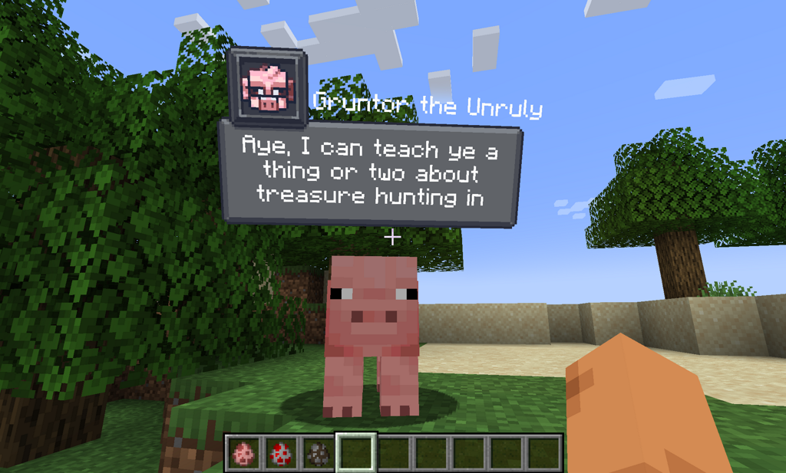
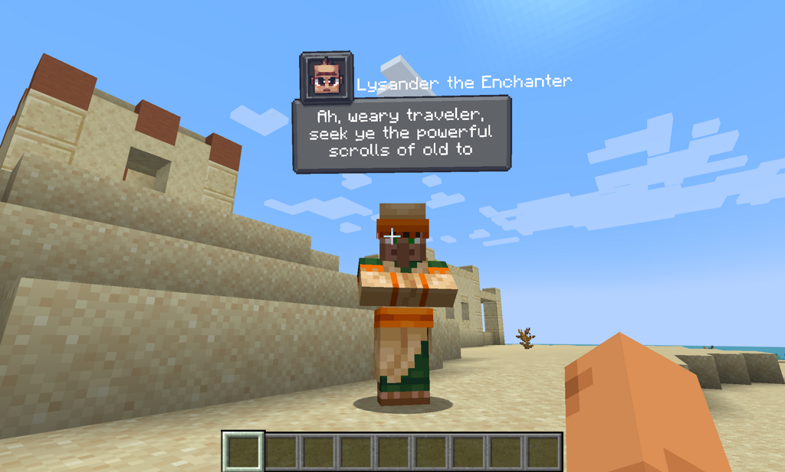

# CreatureChat

### Chat, befriend, and interact with a rich world of creatures like never before! All creatures can talk and respond naturally using AI. 

## Features:
- **Dynamic Dialogues**: Engage with Minecraft creatures like never before, each with a unique character sheet.
- **AI-Driven Chats**: Powered by ChatGPT, ensuring each conversation is fresh and engaging.
- **Custom Behaviors**: Creatures can make decisions on their own and **Follow, Flee, Attack**, and more!
- **Friendship Status**: Track your relationships on a 7-point scale, from foes to friends.
- **Multi-Player Interaction**: Share the experience; conversations sync across server & players.
- **Personalized Memory**: Creatures remember past interactions, making each chat more personal.
- **Model Support**: Flexible backend, compatible with various GPT and open-sources LLM models.

Looking to enrich your Minecraft journey with deep conversations and lasting alliances?
**Step into the world of CreatureChat 🗨 and spark your first conversation today!**

## Installation
1. **Install Fabric Loader**: Follow the instructions [here](https://fabricmc.net/use/).
2. **Download Fabric API**: Get the version which we support (refer to `gradle.properties` for supported Minecraft and Fabric versions)
   from [Modrinth](https://modrinth.com/mod/fabric-api)
   or [CurseForge](https://www.curseforge.com/minecraft/mc-mods/fabric-api).
3. **Install CreatureChat Mod**: Place `creaturechat-*.jar` and `fabric-api-*.jar` into your `.minecraft/mods`
   folder.

## Commands
The CreatureChat mod allows users to configure settings via in-game commands. Here's how to use them:

### Command Usage
- `/creaturechat key set <key>`
  Sets the **OpenAI API key**. This is required for making requests to the LLM.
- `/creaturechat url set <url>`
  **Optional:** Sets the URL of the API used to make LLM requests.
- `/creaturechat model set <model>`
  **Optional:** Sets the model used for generating responses in chats.

### Configuration Scope:
  You can specify the **optional** configuration scope at the end of each command to determine where settings should be applied:

- **Default** Configuration (`--config default`):
  Applies the configuration universally, unless overridden by a server-specific configuration.
- **Server**-Specific Configuration (`--config server`):
  Applies the configuration only to the server where the command is executed.
- If the `--config` option is not specified, the `default` configuration scope is assumed.

## Screenshots

## Upgrade Dependencies

When Fabric or Minecraft is updated, the build dependencies need to also
be updated. Below are the general steps for this upgrade process.

1. Visit https://fabricmc.net/develop for updated version #s
2. Copy/paste the recommended versions into `gradle.properties`
3. **Optional:** Update the Loom version in `build.gradle` 
4. Re-build: `./gradlew build` and watch for any errors
5. Re-run: `./gradlew runClient`
6. **Optional:** Re-start **IntelliJ IDEA** to clear cached gradle

## Authors

- Jonathan Thomas <jonathan@openshot.org>
- Owlmaddie <owlmaddie@gmail.com>

## Contact & Resources

- [Source Code](http://gitlab.openshot.org/minecraft/creature-chat)

## License

    CreatureChat is a Minecraft mod which allows chat conversations with entities.
    Copyright (C) 2024 Owlmaddie LLC

    This program is free software: you can redistribute it and/or modify
    it under the terms of the GNU General Public License as published by
    the Free Software Foundation, either version 3 of the License, or
    (at your option) any later version.

    This program is distributed in the hope that it will be useful,
    but WITHOUT ANY WARRANTY; without even the implied warranty of
    MERCHANTABILITY or FITNESS FOR A PARTICULAR PURPOSE.  See the
    GNU General Public License for more details.

    You should have received a copy of the GNU General Public License
    along with this program.  If not, see <https://www.gnu.org/licenses/>.
