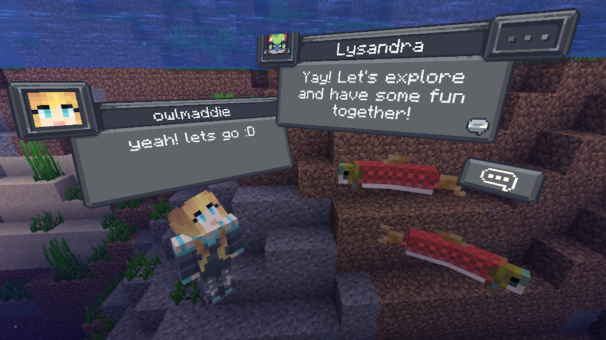
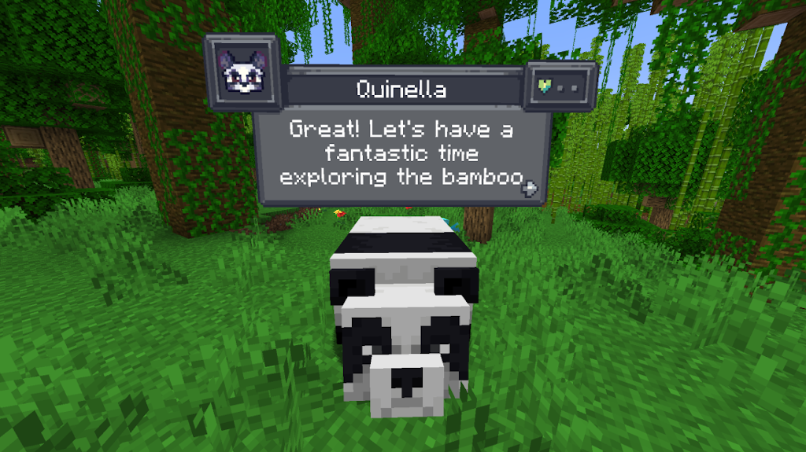
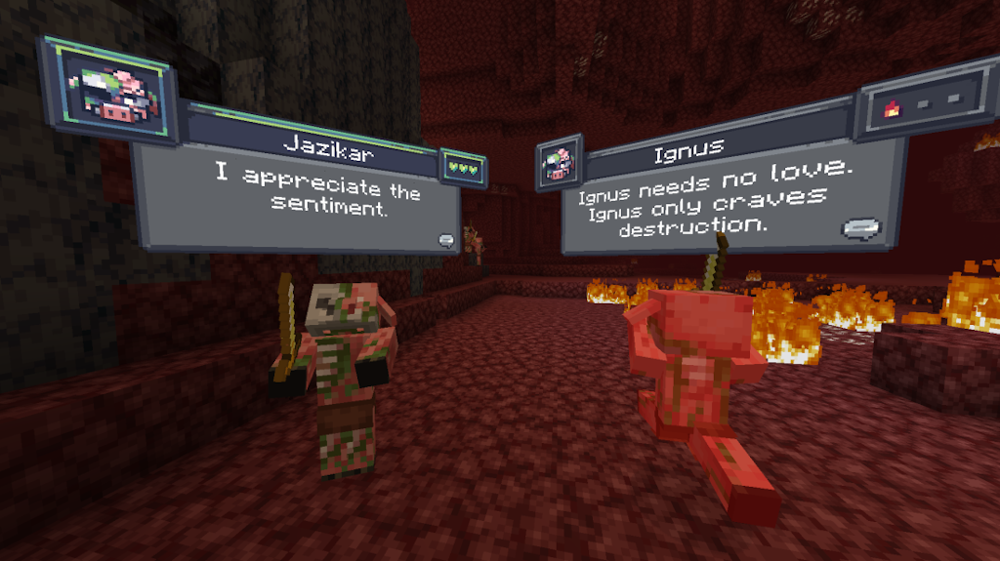

# Creature Pals

Download the [Player2 app](https://player2.game), install the Fabric API, and play this mod in Minecraft.

Create meaningful conversations and enduring friendships? Watch the mobs and AI players interact with each other in chaos.

👉 [Check releases](https://github.com/elefant-ai/creature-pals/releases)

[!Disclaimer]
This is a Player2 mod developed by Elefant AI and is not affiliated with the original CreatureChat developers

## What is Creature Pals Evolved?
**Creature Pals Evolved** is a Minecraft mod that lets you chat with any creature in the game using AI. With built-in [Player2](https://player2.game/) integration, creatures can speak, remember past interactions, and react dynamically to your actions — no extra setup required. 

## New Features Compared to CreatureChat
- **No LLM/API Setup:** All you need is the [Player2 App](https://player2.game/), no need to set up your own API account.
- **Multi-Player:** New chat system that allow players including AI player to chat with mobs through Minecraft's own messaging system.
- **Version Updates:** Re-write particle effects to supports 1.21.1 Fabric and Neoforge
- **Coming:** TTS/STT capabilities

## Maintained features from CreatureChat
- **Behaviors:** Creatures can make decisions on their own and **Follow, Flee, Attack, Protect**, and more!
- **Reactions:** Creatures automatically react to being damaged or receiving items from players.
- **Friendship:** Track your relationships from friends to foes.
- **Memory:** Creatures remember your past interactions, making each chat more personal.

## Installation Instructions
👉 Check [releases](https://github.com/elefant-ai/creature-pals/releases) and download the appropriate jar file for your Minecraft version.

Then follow either of the following:

### Fabric (Recommended)
1. **Install the Player2 App:** Download, run, and install the [Player2 App](https://player2.game/).
2. **Install Fabric Loader & API:** Follow the instructions [here](https://fabricmc.net/use/).
3. **Install Creature Pals Mod:** Download and copy the `creaturepals-*.jar` and `fabric-api-*.jar`, into your `.minecraft/mods` folder.
4. **Launch Minecraft** with the Fabric profile.

### Forge (with Sinytra Connector)
*NOTE: Sinytra Connector only supports up to Minecraft 1.21.1.*

1. **Install Forge:** Download [NeoForge Installer](https://neoforged.net/), select `1.21.1` and install.
2. **Install Forgified Fabric API:** Download [Forgified Fabric API](https://curseforge.com/minecraft/mc-mods/forgified-fabric-api) and copy the `*.jar` into your `.minecraft/mods` folder.
3. **Install Sinytra Connector:** Download [Sinytra Connector](https://www.curseforge.com/minecraft/mc-mods/sinytra-connector) and copy the `*.jar` into your `.minecraft/mods` folder.
4. **Install Creature Pals Mod:** Download and copy the jar file into your `.minecraft/mods` folder.
5. **Install the Player2 App:** Download, install, and run the [Player2 App](https://player2.game/).
6. **Launch Minecraft** with the Forge profile.

# In-game Commands / Configuration
- **OPTIONAL:** `/creaturepals url set "<url>"`
  - Sets the URL of the API used to make LLM requests. Defaults to `"https://api.openai.com/v1/chat/completions"`.
- **OPTIONAL:** `/creaturepals model set <model>`
  - Sets the model used for generating responses in chats. Defaults to `gpt-3.5-turbo`.
- **OPTIONAL:** `/creaturepals timeout set <seconds>`
  - Sets the timeout (in seconds) for API HTTP requests. Defaults to `10` seconds.
- **OPTIONAL:** `/creaturepals whitelist <entityType | all | clear>` - Show chat bubbles
  - Shows chat bubbles for the specified entity type or all entities, or clears the whitelist.
- **OPTIONAL:** `/creaturepals blacklist <entityType | all | clear>` - Hide chat bubbles
  - Hides chat bubbles for the specified entity type or all entities, or clears the blacklist.
- **OPTIONAL:** `/story set "<story-text>"`
  - Sets a custom story (included in character creation and chat prompts).
- **OPTIONAL:** `/story display | clear`
  - Display or clear the current story.

#### Configuration Scope (default | server):
- **OPTIONAL:** Specify the configuration scope at the end of each command to determine where settings should be applied:
  - **Default Configuration (`--config default`):** Applies the configuration universally, unless overridden by a server-specific configuration.
  - **Server-Specific Configuration (`--config server`):** Applies the configuration only to the server where the command is executed.
  - If the `--config` option is not specified, the `default` configuration scope is assumed.

# Screenshots

# Custom API (Optional)
If you prefer to configure your own LLM, and do not want to use the Player2 App, you can follow these instructions:

Creature Pals **requires** an AI / LLM (large language model) to generate text (characters and chat). There are many different
options for connecting an LLM. 
1. **Free & Local**: Use open-source and free-to-use LLMs without any API fees. [**Difficulty: Hard**]
2. **Bring Your Own Key**: Use your own API key from providers like OpenAI or Groq. [**Difficulty: Medium**]

### 1. Free & Local
CreaturePals fully supports **free and open-source** LLMs. To get started:

- An HTTP endpoint compatible with the OpenAI Chat Completion JSON syntax is required. We highly recommend using:
  - [Ollama](https://ollama.com/) & [LiteLLM](https://litellm.vercel.app/) as your HTTP proxy.
  - **LiteLLM Features:**
    - Supports over **100+ LLMs** (e.g., Anthropic, VertexAI, HuggingFace, Google Gemini, and Ollama).
    - Proxies them through a local HTTP endpoint compatible with Creature Pals.
    - **Note:** Running a local LLM on your computer requires a powerful GPU.
  - Set the local HTTP endpoint in-game:
    - `/creaturepals url set "http://ENTER-YOUR-HTTP-ENDPOINT-FROM-LITE-LLM"`
    - `/creaturepals model set ENTER-MODEL-NAME`
    - `/creaturepals timeout set 360`

### 2. Bring Your Own Key
For those already using a third-party API (e.g., OpenAI, Groq):

- Integrate your own API key for seamless connectivity.
- Costs depend on the provider’s usage-based pricing model.
- By default, Creature Pals uses the OpenAI endpoint and `gpt-3.5-turbo` model, known for its balance of low cost and fast performance.
- Be aware that OpenAI’s developer API does not include free usage. Please review the [OpenAI pricing](https://openai.com/api/pricing/) for detailed information.
- To create an OpenAI API key, visit [https://platform.openai.com/api-keys](https://platform.openai.com/api-keys), and use the **+ Create new secret key** button.
- Set the API key & model in-game:
  - `/creaturepals key set <YOUR-SECRET-KEY-HERE>`
  - `/creaturepals model set gpt-3.5-turbo`

# Acknowledgements

Creature Pals is a fork of the [CreatureChat](https://github.com/CreatureChat/creature-chat) mod, by Jonathan Thomas and owlmaddie.
