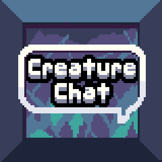
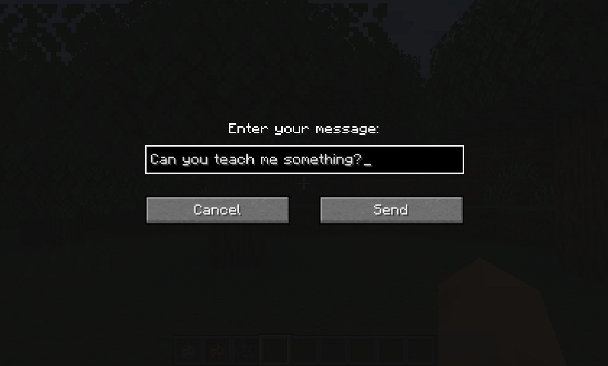

# CreatureChat

### Chat, befriend, and interact with a rich world of creatures like never before! All creatures can talk and respond naturally using AI.

## Features:
- **Dynamic Dialogues**: Engage with Minecraft creatures like never before, each with a unique character sheet.
- **AI-Driven Chats**: Powered by ChatGPT, ensuring each conversation is fresh and engaging.
- **Custom Behaviors**: Creatures can make decisions on their own and **Follow, Flee, Attack**, and more!
- **Reactive Interactions**: Creatures automatically react to being damaged or receiving items from players.
- **Friendship Status**: Track your relationships on a 7-point scale, from foes to friends.
- **Custom UI Artwork**: Features beautiful hand-drawn icons for entities, expressive chat bubbles.
- **Multi-Player Interaction**: Share the experience; conversations sync across server & players.
- **Personalized Memory**: Creatures remember past interactions, making each chat more personal.
- **Model Support**: Flexible backend, compatible with various GPT and open-sources LLM models.

Ready to deepen your Minecraft journey with meaningful conversations and enduring friendships?
**Step into the world of CreatureChat 🗨 and spark your first conversation today!**

## Installation
1. **Install Fabric Loader**: Follow the instructions [here](https://fabricmc.net/use/).
1. **Install CreatureChat Mod**: Place `creaturechat-*.jar` and `fabric-api-*.jar` into your `.minecraft/mods`
   folder.
1. **Create an OpenAI API key**: Visit https://platform.openai.com/api-keys, and use the `+ Create new secret key` button.
   Copy/Paste your key into the `/creaturechat key set <your-secret-key-here>` command. 
   By default, we use the `gpt-3.5-turbo`, although we support most models. Review pricing at 
   https://openai.com/pricing#language-models.

## Commands
The CreatureChat mod allows users to configure settings via in-game commands. Here's how to use them:

### Command Usage
- `/creaturechat key set <key>`
  Sets the **OpenAI API key**. This is required for making requests to the LLM.
- `/creaturechat url set <url>`
  **OPTIONAL:** Sets the URL of the API used to make LLM requests.
- `/creaturechat model set <model>`
  **OPTIONAL:** Sets the model used for generating responses in chats.

### Configuration Scope:
  You can specify the **optional** configuration scope at the end of each command to determine where settings should be applied:

- **Default** Configuration (`--config default`):
  Applies the configuration universally, unless overridden by a server-specific configuration.
- **Server**-Specific Configuration (`--config server`):
  Applies the configuration only to the server where the command is executed.
- If the `--config` option is not specified, the `default` configuration scope is assumed.

## Screenshots

## Upgrade Dependencies

When Fabric or Minecraft is updated, the build dependencies need to also
be updated. Below are the general steps for this upgrade process.

1. Visit https://fabricmc.net/develop for updated version #s
1. Copy/paste the recommended versions into `gradle.properties`
1. **Optional:** Update the Loom version in `build.gradle` 
1. Re-build: `./gradlew build` and watch for any errors
1. Re-run: `./gradlew runClient`
1. **Optional:** Re-start **IntelliJ IDEA** to clear cached gradle

## Costs Associated with Third-Party LLM APIs
Using third-party Large Language Model (LLM) APIs, such as OpenAI, will incur usage-based fees. 
These fees are typically based on the amount of data processed or the number of requests made 
to the service. Before integrating or using these APIs, please review the pricing details 
provided by the API provider. Be aware of the potential costs and plan your usage accordingly 
to avoid unexpected charges.

By using this software and integrating third-party APIs, you acknowledge and agree to take 
full responsibility for securing your API keys and managing API usage within the terms and 
cost structures outlined by the providers.

## API Key Confidentiality
Always keep your API keys confidential to prevent unauthorized access and potential misuse.
Exposing your API key publicly can lead to security risks, unauthorized usage, and potential
service abuse. Treat your API keys as sensitive information and only share them with trusted
parties within secure environments.

## Authors

- Jonathan Thomas <jonathan@openshot.org>
- owlmaddie <owlmaddie@gmail.com>

## Contact & Resources

- [Source Code](http://gitlab.openshot.org/minecraft/creature-chat)
- [Join us on Discord](https://discord.gg/m9dvPFmN3e)

## License

    CreatureChat is a Minecraft mod which allows chat conversations with entities.
    Copyright (C) 2024 owlmaddie LLC

    This program is free software: you can redistribute it and/or modify
    it under the terms of the GNU General Public License as published by
    the Free Software Foundation, either version 3 of the License, or
    (at your option) any later version.

    This program is distributed in the hope that it will be useful,
    but WITHOUT ANY WARRANTY; without even the implied warranty of
    MERCHANTABILITY or FITNESS FOR A PARTICULAR PURPOSE.  See the
    GNU General Public License for more details.

    You should have received a copy of the GNU General Public License
    along with this program.  If not, see <https://www.gnu.org/licenses/>.
